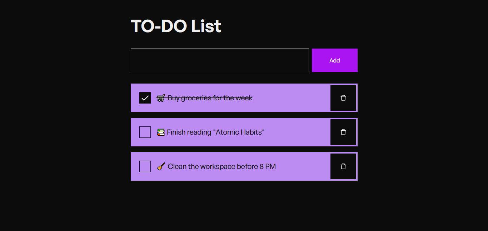

# 📅 Full-Stack TODO List App

A fully functional and responsive TODO List application built using:



* 🤳 **Frontend:** React (Vite)
* 🐍 **Backend:** Python (Flask)
* 📄 **Database:** MySQL

This project demonstrates a simple CRUD-based task manager app where users can **Create**, **Read**, **Update**, and **Delete** tasks with a clean UI and RESTful API integration.

---

## 🔧 Tech Stack

| Layer    | Technology                       |
| -------- | -------------------------------- |
| Frontend | React + Vite + Tailwind CSS      |
| Backend  | Python + Flask + Flask-CORS      |
| Database | MySQL via mysql-connector-python |

---

## 📄 Features

* ✅ Add tasks
* ✅ View all tasks
* ✅ Edit/update tasks
* ✅ Delete tasks
* ✅ Responsive design
* ✅ REST API integration
* ✅ Clean, maintainable folder structure

---

## 🔍 SEO Keywords

```
react flask mysql todo app, fullstack todo list app, python mysql todo app, react python mysql project, full stack crud project, flask backend mysql, vite react frontend, beginner full stack project, flask todo api
```

---

## 🛁 Folder Structure

```
ToDo-List/
├── client/        # React Vite frontend
│   └── ...
├── server/        # Flask backend
│   ├── app.py
│   ├── routes.py
│   ├── models.py
│   └── db.py
└── README.md
```

---

## 🚀 Getting Started

### 1. Clone the Repository

```bash
git clone https://github.com/thinakaranmanokaran/ToDO-App.git
cd ToDO-App
```

### 2. Run the Backend (Python + Flask)

```bash
cd server
pip install -r requirements.txt
python app.py
```

### 3. Run the Frontend (React + Vite)

```bash
cd client
npm install
npm run dev
```

The app will be available at `http://localhost:5173` and the API at `http://localhost:5000`

---

## 🌐 Live Demo

Coming soon...

---

## 👨‍💼 About the Developer

Made with passion by **Thinakaran Manokaran** — MERN Stack Developer & Trainer passionate about full-stack development, clean UI/UX, and scalable architecture.

### 🌐 Portfolio:

[https://thinakaranmanokaran.netlify.app](https://thinakaranmanokaran.netlify.app)

### 👤 LinkedIn:

[https://www.linkedin.com/in/thinakaran-manokaran](https://www.linkedin.com/in/thinakaran-manokaran)

---

## ✨ Contributions

Contributions, issues, and feedback are always welcome!

If you liked this project, don’t forget to give it a ⭐ on GitHub!

---

## 📖 License

This project is licensed under the MIT License - see the [LICENSE](LICENSE) file for details.
